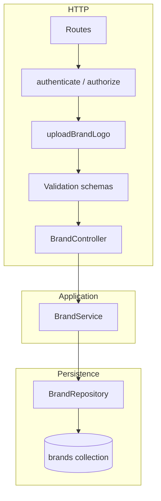
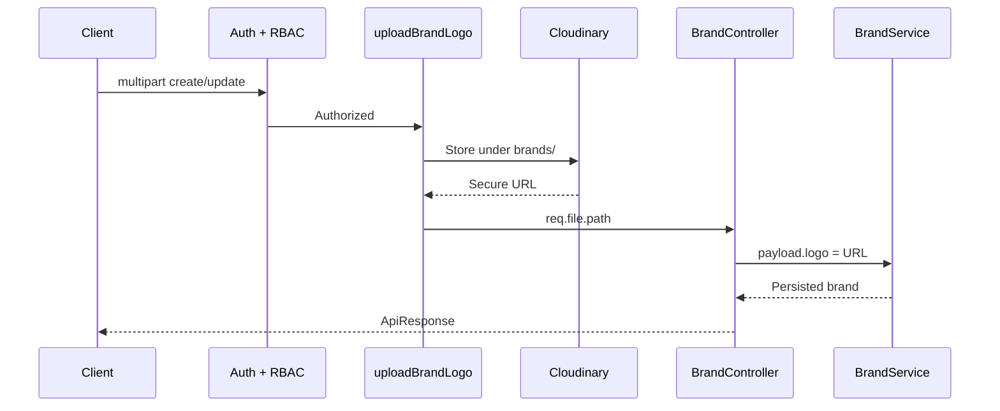
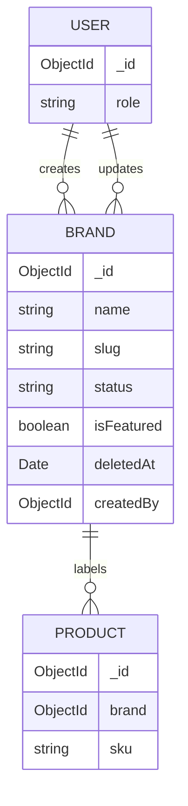
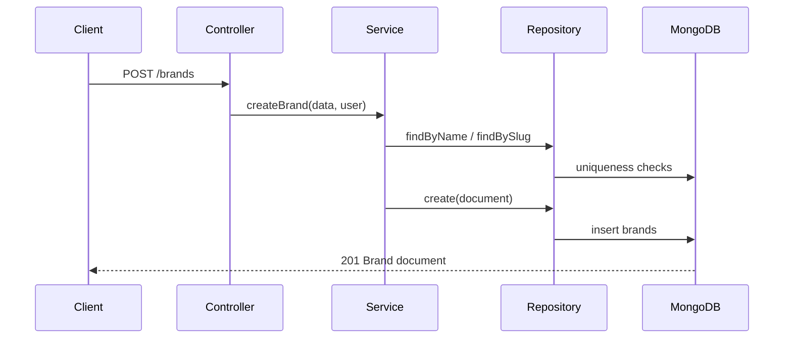

# Enterprise E-commerce — Brand Module Developer Documentation

**Module:** Brand Catalog (Module 10)  
**Stack:** Node.js · Express · TypeScript · MongoDB · Mongoose · JWT · RBAC · Cloudinary  
**Audience:** Backend engineers, tech leads, API consumers, QA, handover recipients  
**Document version:** 1.0  
**Base API path:** `/api/v1/brands`  
**Status:** Module 10 completed (foundation through listing & logo upload)

---

## Table of Contents

1. [Module Overview](#1-module-overview)
2. [Objectives](#2-objectives)
3. [Folder Structure](#3-folder-structure)
4. [Architecture](#4-architecture)
5. [Brand Schema](#5-brand-schema)
6. [Repository](#6-repository)
7. [Service](#7-service)
8. [Controller](#8-controller)
9. [Validation](#9-validation)
10. [Routes](#10-routes)
11. [Brand Logo Upload (Multer + Cloudinary)](#11-brand-logo-upload-multer--cloudinary)
12. [Search, Filtering, Pagination & Sorting](#12-search-filtering-pagination--sorting)
13. [API Endpoints](#13-api-endpoints)
14. [Request/Response Examples](#14-requestresponse-examples)
15. [Database Flow](#15-database-flow)
16. [Security](#16-security)
17. [Error Handling](#17-error-handling)
18. [Best Practices](#18-best-practices)
19. [Testing](#19-testing)
20. [Summary](#20-summary)

---

# 1. Module Overview

## 1.1 Purpose

The **Brand Module** owns manufacturer and label identity within the Enterprise E-commerce catalog. It stores brand profile data (name, slug, description, website), merchandising signals (`status`, `isFeatured`), SEO fields, Cloudinary-hosted logos, and audit metadata (`createdBy`, `updatedBy`).

Products reference brands by ObjectId. This module therefore acts as a catalog dependency for Product merchandising, storefront filtering, and admin brand governance.

## 1.2 Delivery Map (Module 10)

| Step | Capability | Status |
|------|------------|--------|
| 10.1 | Module foundation (layers, barrel, DI stubs) | Completed |
| 10.2 | Enterprise Brand Mongoose schema (soft delete, status enum, slug middleware) | Completed |
| 10.3 | Brand Repository | Completed |
| 10.4 | Brand Service (uniqueness, status transitions, listing) | Completed |
| 10.5 | Brand Controller | Completed |
| 10.6 | express-validator schemas | Completed |
| 10.7 | Public + Admin routes | Completed |
| 10.8 | Logo upload via shared Multer + Cloudinary | Completed |
| 10.9 | Search, filter, sort, pagination | Completed |

## 1.3 Relationship to Other Modules

| Module | Relationship |
|--------|--------------|
| **Product** | Products reference `Brand` via ObjectId; listing may filter by brand |
| **Category** | Sibling modular catalog vertical; shared patterns for layers, listing envelope, auth/RBAC, upload |
| **Auth / RBAC** | Mutations require JWT + `ADMIN` / `SUPER_ADMIN` |
| **Upload** | Reuses shared middleware; Brand adds logo-specific Cloudinary folder and SVG support |

## 1.4 Non-Objectives (Deferred)

- Hard delete / purge jobs for soft-deleted brands  
- Automatic Cloudinary asset cleanup when logos are replaced  
- Brand ↔ Product referential delete guards (service-level product linkage checks)  
- Elasticsearch / Atlas Search ranking  
- Redis caching of featured brand lists  
- Multi-language brand names  

---

# 2. Objectives

**Why this module exists**

1. **Single source of truth for brand identity** — avoid duplicated brand strings across products.  
2. **Enterprise layering** — HTTP, domain rules, and persistence remain separated (SRP / DIP).  
3. **Safe lifecycle management** — soft delete, status transitions, and uniqueness rules protect catalog integrity.  
4. **Operational readiness** — indexed queries, lean listing reads, pagination metadata identical to Product and Category.  
5. **Media consistency** — logos stored as CDN URLs via the same Multer + Cloudinary infrastructure used elsewhere.  
6. **Onboarding clarity** — modular layout under `src/modules/brand/` mirrors Category for faster engineer ramp-up.

**Success criteria for handover**

- New engineers can locate each layer and explain request flow without reading Product code first.  
- Admins can create, update, soft-delete, and list brands with predictable API contracts.  
- Listing behavior and response envelopes match Product / Category conventions.

---

# 3. Folder Structure

```text
server/src/modules/brand/
├── brand.controller.ts       # Thin HTTP adapters
├── brand.service.ts          # Business rules & listing normalization
├── brand.repository.ts       # MongoDB data access
├── brand.routes.ts           # Route wiring + DI composition root
├── brand.validation.ts       # express-validator schemas
├── brand.interface.ts        # Module-level domain payload contracts
├── brand.constants.ts        # Module defaults / status constants
├── index.ts                  # Public barrel exports
└── models/
    └── brand.model.ts        # Foundation stub (historical); canonical schema lives below

# Canonical persistence model & shared contracts
server/src/models/brand.model.ts
server/src/interfaces/brand.interface.ts   # IBrand, IBrandDocument, IBrandModel, BrandStatus

# Shared infrastructure reused by Brand
server/src/middleware/
├── auth.middleware.ts
├── role.middleware.ts
└── upload.middleware.ts      # export: uploadBrandLogo

server/docs/
└── BRAND_MODULE_STEP_10.md   # This document
```

**Mount target:** `/api/v1/brands` (as documented in `brand.routes.ts`). Ensure the application composition root mounts `brandRoutes` under the versioned API prefix.

**Note on dual model locations:** The enterprise schema used by the repository is `src/models/brand.model.ts`. The module foundation stub under `modules/brand/models/` was created early in Module 10; the repository imports the shared enterprise model. Prefer the shared model as the source of truth for persistence behavior.

---

# 4. Architecture

## 4.1 Layered Design



| Layer | Responsibility | Must not |
|-------|----------------|----------|
| **Routes** | Wire middleware, validators, controller methods | Contain business rules |
| **Controller** | Parse HTTP, call service, shape `ApiResponse`, `next(error)` | Touch Mongoose or uniqueness logic |
| **Service** | Uniqueness, status transitions, slug resolution, listing defaults | Run raw queries or read `req`/`res` |
| **Repository** | CRUD, soft delete, listing filters, lean reads | Enforce domain policy |
| **Model** | Schema, indexes, soft-delete query scope, slug auto-generation | Own HTTP or service orchestration |

## 4.2 Dependency Injection

At the Brand routes composition root:

1. Instantiate `BrandRepository` (defaults to enterprise Brand model).  
2. Inject repository into `BrandService`.  
3. Inject service into `BrandController`.  

This mirrors Category and Product and keeps the service unit-testable with a mock repository.

## 4.3 Design Principles Applied

| Principle | How Brand applies it |
|-----------|----------------------|
| **SRP** | Each file has one reason to change |
| **DIP** | Service depends on repository API, not Mongoose collections |
| **OCP** | Listing options extend without changing controller contracts |
| **Consistency** | Pagination meta and success envelope match Product / Category |
| **Reuse** | Auth, RBAC, upload, and `ApiResponse` are shared |

---

# 5. Brand Schema

**Location:** `server/src/models/brand.model.ts`  
**Contracts:** `server/src/interfaces/brand.interface.ts`  
**Collection:** `brands`

## 5.1 Field Catalog

| Field | Type | Required | Notes |
|-------|------|----------|-------|
| `name` | String | Yes | Unique, trimmed, max 120 |
| `slug` | String | Yes | Unique, lowercase; auto-generated from name when omitted |
| `description` | String | No | Max 1000 |
| `logo` | String | No | Cloudinary (or CDN) URL |
| `website` | String | No | Brand website URL |
| `status` | Enum | Yes | `ACTIVE` \| `INACTIVE` (default `ACTIVE`) |
| `isFeatured` | Boolean | No | Default `false` |
| `seoTitle` | String | No | Max 150 |
| `seoDescription` | String | No | Max 300 |
| `createdBy` | ObjectId → User | Yes | Set on create |
| `updatedBy` | ObjectId → User | No | Set on update |
| `deletedAt` | Date \| null | No | Soft-delete marker; `null` = live |
| `createdAt` / `updatedAt` | Date | Auto | Mongoose timestamps |

Schema options: **timestamps enabled**, **versionKey disabled**.

## 5.2 Indexes

| Index | Purpose |
|-------|---------|
| Unique `name` | Enforce uniqueness + lookup |
| Unique `slug` | Public slug routes + uniqueness |
| `status` | Filter ACTIVE / INACTIVE |
| `isFeatured` | Featured brand queries |
| `createdAt` | Default listing sort |

## 5.3 Middleware Behavior

| Hook | Behavior |
|------|----------|
| **Pre-validate** | If slug is empty, generate a URL-safe slug from `name` |
| **Pre-find / countDocuments** | Restrict to documents where `deletedAt` is `null` (soft-delete scope) |

## 5.4 Model Helpers (Schema-Level)

| Kind | Name | Intent |
|------|------|--------|
| Static | `findBySlug` | Convenience lookup by slug |
| Static | `findActive` | Brands with `ACTIVE` status |
| Static | `findFeatured` | Featured brands |
| Instance | `activate` / `deactivate` | Persist status change on the document |

Application orchestration still prefers the **Service + Repository** path for HTTP use cases; schema helpers are available for scripts and advanced composition.

## 5.5 TypeScript Contracts

| Interface | Role |
|-----------|------|
| `IBrand` | Field-level domain shape |
| `IBrandDocument` | Mongoose document + instance methods |
| `IBrandModel` | Model type + static methods |
| `BrandStatus` | `ACTIVE` / `INACTIVE` enum |

---

# 6. Repository

**File:** `brand.repository.ts`  
**Role:** Persistence only — no business policy.

## 6.1 Core Operations

| Method | Description |
|--------|-------------|
| `create` | Insert brand document |
| `findById` | Fetch by ObjectId (lean, optional projection) |
| `findByName` | Exact name match |
| `findBySlug` | Exact slug match |
| `findAll` | Filtered find with optional search/sort/pagination; returns `{ items, total }` |
| `findByListing` | Enterprise listing entrypoint (delegates to `findAll` with normalized options) |
| `updateById` | Partial update with validators |
| `softDelete` | Sets `deletedAt` to current timestamp (no hard delete) |
| `updateStatus` | Updates `status` only |
| `count` | Count matching filter |
| `exists` | Boolean existence check |

## 6.2 Listing Internals

`findByListing` accepts a normalized query from the service and:

1. Builds a Mongo filter for keyword (`name` / `slug` / `description`), `status`, `isFeatured`, and optional `createdBy`.  
2. Applies sort from `sortBy` + `sortDirection`.  
3. Applies `skip` / `limit` from `page` / `limit`.  
4. Optionally projects fields.  
5. Runs find + `countDocuments` in parallel with **lean** reads.

Soft-deleted rows are excluded by the model’s query middleware; the repository does not implement a second delete policy.

## 6.3 Soft Delete Semantics

`softDelete(id)` updates `deletedAt`. Subsequent finds and counts exclude that document. There is no repository hard-delete method for Brand (by design).

---

# 7. Service

**File:** `brand.service.ts`  
**Role:** Domain rules and use-case orchestration. Uses **BrandRepository only** — never the Brand model directly.

## 7.1 Use Cases

| Method | Behavior |
|--------|----------|
| `createBrand` | Trim name; enforce unique name/slug; default status `ACTIVE`; set `createdBy`; `deletedAt = null` |
| `getBrandById` / `getBrandBySlug` | Throw if not found |
| `getAllBrands` | Normalize listing input → `findByListing` → pagination metadata |
| `updateBrand` | Re-check uniqueness; optional status transition; set `updatedBy` |
| `deleteBrand` | Soft delete only |
| `updateBrandStatus` | Validate and apply allowed status transition |

## 7.2 Business Rules

| Rule | Enforcement |
|------|-------------|
| Unique name | Global; conflict throws domain error |
| Unique slug | Global; slug generated from name when omitted |
| Default status | `ACTIVE` on create when status omitted |
| Soft delete only | `deleteBrand` → `repository.softDelete` |
| Status transitions | Only `ACTIVE` ↔ `INACTIVE`; same status rejected; invalid values rejected |

## 7.3 Listing Defaults

| Setting | Value |
|---------|-------|
| Default page | 1 |
| Default limit | 10 |
| Maximum limit | 100 |
| Default sortBy | `createdAt` |
| Default sortOrder | `desc` |

## 7.4 Pagination Metadata (Product / Category Identical)

| Field | Meaning |
|-------|---------|
| `total` | Matching document count |
| `page` | Current page |
| `limit` | Page size |
| `totalPages` | Ceiling of total / limit (0 when empty) |
| `hasNext` | `page < totalPages` |
| `hasPrevious` | `page > 1` and results exist |

---

# 8. Controller

**File:** `brand.controller.ts`  
**Role:** Thin HTTP adapter. Uses **BrandService only**.

## 8.1 Responsibilities

- Extract route params, query strings, and body payloads.  
- Require authenticated user for mutations (`req.user`).  
- Merge optional Cloudinary logo URL from `req.file` into create/update payloads.  
- Return standardized success envelopes.  
- Forward failures with `next(error)`.

## 8.2 Handlers

| Handler | HTTP role |
|---------|-----------|
| `createBrand` | 201 create |
| `getBrandById` | 200 by id |
| `getBrandBySlug` | 200 by slug |
| `getAllBrands` | 200 list + pagination |
| `updateBrand` | 200 update (optional logo) |
| `deleteBrand` | 200 soft delete |
| `updateBrandStatus` | 200 status patch |

## 8.3 Response Envelope

Success responses follow the shared `ApiResponse` contract:

- `success: true`  
- `message: string`  
- `data: ...`  

Listing responses additionally include `pagination` (same shape as Product and Category).

Unauthorized mutations without `req.user` return `401` with `success: false` and message `Unauthorized`.

---

# 9. Validation

**File:** `brand.validation.ts`  
**Library:** `express-validator` (same as Product and Category)

## 9.1 Schemas

| Schema | Applied to |
|--------|------------|
| `createBrandSchema` | `POST /` |
| `updateBrandSchema` | `PATCH /:id` |
| `updateBrandStatusSchema` | `PATCH /:id/status` |
| `brandIdParamSchema` | Routes with `:id` |
| `brandSlugParamSchema` | `GET /slug/:slug` |
| `getBrandsQuerySchema` | `GET /` |

## 9.2 Body Rules (Summary)

| Field | Create | Update |
|-------|--------|--------|
| `name` | Required, 2–120 chars | Optional, same bounds |
| `slug` | Optional; lowercase hyphenated format | Optional |
| `description` | Optional, max 1000 | Optional |
| `logo` | Optional URL (or file via Multer) | Optional URL or file |
| `website` | Optional URL | Optional |
| `status` | Optional `ACTIVE`/`INACTIVE` | Optional |
| `isFeatured` | Optional boolean | Optional |
| `seoTitle` / `seoDescription` | Optional length-capped | Optional |

**Unknown fields** on create, update, and status payloads are rejected via an allow-list custom validator (enterprise strictness aligned with Brand Module requirements).

**Update rule:** At least one allowed body field **or** an uploaded logo file must be present.

## 9.3 Query Rules (Summary)

| Query | Rules |
|-------|-------|
| `keyword` / `search` | Optional strings |
| `page` | Default 1, integer ≥ 1 |
| `limit` | Default 10, integer 1–100 |
| `sortBy` | `name` \| `createdAt` \| `updatedAt` |
| `sortOrder` | `asc` \| `desc` |
| `status` | `ACTIVE` \| `INACTIVE` |
| `isFeatured` | Boolean |
| `createdBy` | Optional ObjectId |
| `fields` | Optional comma-separated projection |

---

# 10. Routes

**File:** `brand.routes.ts`  
**Composition:** Repository → Service → Controller  
**Intended mount:** `/api/v1/brands`

## 10.1 Endpoint Map

| Method | Path | Auth | Roles | Notes |
|--------|------|------|-------|-------|
| GET | `/` | Public | — | Listing |
| GET | `/slug/:slug` | Public | — | Static path before `/:id` |
| GET | `/:id` | Public | — | By id |
| POST | `/` | JWT | ADMIN, SUPER_ADMIN | Optional `logo` multipart |
| PATCH | `/:id` | JWT | ADMIN, SUPER_ADMIN | Optional `logo` multipart |
| PATCH | `/:id/status` | JWT | ADMIN, SUPER_ADMIN | Status only |
| DELETE | `/:id` | JWT | ADMIN, SUPER_ADMIN | Soft delete |

## 10.2 Middleware Order (Mutations with Upload)

Typical create stack:

1. `authenticate`  
2. `authorize(ADMIN, SUPER_ADMIN)`  
3. `uploadBrandLogo`  
4. Validation chains  
5. Controller handler  

Status and delete skip upload middleware. `PATCH /:id/status` is registered before `PATCH /:id` so the static `status` segment matches correctly.

## 10.3 Public vs Protected

GET routes are **public**, consistent with the Category module’s public read model. Writes are restricted to privileged admin roles.

---

# 11. Brand Logo Upload (Multer + Cloudinary)

## 11.1 Shared Infrastructure

Brand does **not** introduce a separate upload architecture. It extends `upload.middleware.ts` with:

| Setting | Value |
|---------|-------|
| Export | `uploadBrandLogo` |
| Field name | `logo` (single file) |
| Cloudinary folder | `enterprise-ecommerce/brands` |
| Allowed formats | jpg, jpeg, png, webp, **svg** |
| Max size | 5 MB (shared limit) |
| URL on request | `req.file.path` (Cloudinary secure URL) |

Product and Category MIME allow-lists remain unchanged; Brand uses a dedicated allow-list that adds SVG.

## 11.2 Integration Points

| Route | Behavior |
|-------|----------|
| `POST /brands` | Optional logo upload during create |
| `PATCH /brands/:id` | Optional logo upload to set or replace logo |

The controller merges the uploaded URL into the service payload as `logo`. If no file is present, existing body `logo` URL validation still applies when provided as a string.

## 11.3 Upload Workflow



## 11.4 Environment Dependencies

Cloudinary credentials must be configured in the environment (same variables used by Product and Category). Without valid credentials, logo upload requests fail at the storage adapter.

---

# 12. Search, Filtering, Pagination & Sorting

## 12.1 Search

| Aspect | Detail |
|--------|--------|
| Params | `keyword` (controller also accepts `search`) |
| Fields | `name`, `slug`, `description` |
| Matching | Case-insensitive regular expression (`$or`) |
| Safety | User input escaped before RegExp construction |

## 12.2 Filters

| Param | Type | Behavior |
|-------|------|----------|
| `status` | `ACTIVE` \| `INACTIVE` | Exact match |
| `isFeatured` | boolean | Exact match |

Soft-deleted brands are never returned by normal finds.

## 12.3 Pagination

| Param | Default | Max |
|-------|---------|-----|
| `page` | 1 | — |
| `limit` | 10 | 100 |

## 12.4 Sorting

| `sortBy` | Meaning |
|----------|---------|
| `name` | Alphabetical |
| `createdAt` | Creation time (**default**) |
| `updatedAt` | Last update time |

| `sortOrder` | Direction |
|-------------|-----------|
| `asc` | Ascending |
| `desc` | Descending (**default**) |

## 12.5 Layer Split

| Layer | Listing responsibility |
|-------|------------------------|
| Controller | Map query string → `BrandListInput` |
| Service | Defaults, bounds, enum validation → `BrandListQuery` |
| Repository | Mongo filter/sort/skip/limit + count |

This matches Product Step 8.10 and Category Step 9.9 without duplicating pagination helpers.

---

# 13. API Endpoints

**Base URL:** `/api/v1/brands`

| # | Method | Endpoint | Description |
|---|--------|----------|-------------|
| 1 | GET | `/brands` | List with search/filter/sort/pagination |
| 2 | GET | `/brands/:id` | Fetch by Mongo ObjectId |
| 3 | GET | `/brands/slug/:slug` | Fetch by unique slug |
| 4 | POST | `/brands` | Create brand (optional logo) |
| 5 | PATCH | `/brands/:id` | Update brand (optional logo) |
| 6 | PATCH | `/brands/:id/status` | Update status only |
| 7 | DELETE | `/brands/:id` | Soft delete |

---

# 14. Request/Response Examples

## 14.1 Create Brand (JSON)

**Request**

```http
POST /api/v1/brands
Authorization: Bearer <access_token>
Content-Type: application/json
```

```json
{
  "name": "Nike",
  "description": "Athletic footwear and apparel",
  "website": "https://www.nike.com",
  "isFeatured": true,
  "seoTitle": "Nike Official",
  "seoDescription": "Shop Nike brands"
}
```

**Response — 201**

```json
{
  "success": true,
  "message": "Brand created successfully.",
  "data": {
    "_id": "687abc123def4567890abcde",
    "name": "Nike",
    "slug": "nike",
    "status": "ACTIVE",
    "isFeatured": true,
    "deletedAt": null,
    "createdBy": "687user0000000000000001"
  }
}
```

## 14.2 Create Brand with Logo (Multipart)

```http
POST /api/v1/brands
Authorization: Bearer <access_token>
Content-Type: multipart/form-data
```

Form fields example: `name=Nike`, file field `logo=<image>`.

## 14.3 List Brands

```http
GET /api/v1/brands?keyword=nike&status=ACTIVE&isFeatured=true&page=1&limit=10&sortBy=name&sortOrder=asc
```

**Response — 200**

```json
{
  "success": true,
  "message": "Brands fetched successfully.",
  "data": [],
  "pagination": {
    "total": 25,
    "page": 1,
    "limit": 10,
    "totalPages": 3,
    "hasNext": true,
    "hasPrevious": false
  }
}
```

## 14.4 Get by Slug

```http
GET /api/v1/brands/slug/nike
```

## 14.5 Update Status

```http
PATCH /api/v1/brands/687abc123def4567890abcde/status
Authorization: Bearer <access_token>
Content-Type: application/json
```

```json
{
  "status": "INACTIVE"
}
```

## 14.6 Soft Delete

```http
DELETE /api/v1/brands/687abc123def4567890abcde
Authorization: Bearer <access_token>
```

**Response — 200**

```json
{
  "success": true,
  "message": "Brand deleted successfully.",
  "data": {
    "_id": "687abc123def4567890abcde",
    "deletedAt": "2026-08-01T10:30:00.000Z"
  }
}
```

After soft delete, the brand no longer appears in list or get-by-id queries.

---

# 15. Database Flow

## 15.1 Entity Relationships



## 15.2 Create Flow



## 15.3 Soft Delete Flow

1. Service verifies the brand exists (non-deleted).  
2. Repository sets `deletedAt`.  
3. Model query middleware excludes the document from subsequent reads.  
4. Physical document remains in MongoDB for audit / potential restore (restore API not yet implemented).

## 15.4 Listing Flow

1. Controller maps query params.  
2. Service normalizes page/limit/sort/status.  
3. Repository builds filter, sorts, paginates, counts.  
4. Service attaches pagination metadata.  
5. Controller returns `{ success, message, data, pagination }`.

---

# 16. Security

## 16.1 Authentication

Mutating endpoints require a valid JWT via `authenticate`. Missing or invalid credentials yield unauthorized responses before business logic runs.

## 16.2 RBAC

| Role | Brand mutations |
|------|-----------------|
| `SUPER_ADMIN` | Allowed |
| `ADMIN` | Allowed |
| `VENDOR` | Denied |
| `CUSTOMER` | Denied |
| `DELIVERY_BOY` | Denied |

Public GETs do not require a token.

## 16.3 Input Safety

- express-validator enforces types, lengths, enums, ObjectIds, and slug format.  
- Unknown body fields rejected on create/update/status.  
- Search keywords are regex-escaped in the repository.  
- Upload MIME filtering rejects non-image (and non-SVG for Brand) files.  
- File size capped at 5 MB.

## 16.4 Audit Trail

| Event | Fields |
|-------|--------|
| Create | `createdBy` |
| Update / logo replace | `updatedBy` |
| Soft delete | `deletedAt` |

---

# 17. Error Handling

## 17.1 Pattern

1. Service throws domain `Error` with a clear message.  
2. Controller catches and calls `next(error)`.  
3. Global error middleware maps to HTTP responses (project standard).  

Validation failures are surfaced by the shared validation pipeline used across modules.

## 17.2 Common Domain Messages

| Message | Typical cause |
|---------|---------------|
| `Brand not found.` | Invalid id/slug or soft-deleted brand |
| `Brand with this name already exists.` | Unique name violation |
| `Brand with this slug already exists.` | Unique slug violation |
| `Brand is already ACTIVE/INACTIVE.` | No-op status change |
| `Invalid brand status transition...` | Disallowed transition |
| `Invalid brand status. Allowed: ...` | Unknown status value |
| `Invalid sortBy. Allowed: ...` | Unsupported sort field |
| `Unauthorized` | Missing `req.user` on mutation |

## 17.3 Upload Errors

Unsupported MIME types or oversized files fail in Multer / Cloudinary middleware before the controller persists data. Clients should treat these as client or infrastructure errors according to the global error handler mapping.

---

# 18. Best Practices

1. **Keep layers pure** — never put Mongo filters in controllers or Express types in the service.  
2. **Prefer listing APIs** — use query params on `GET /brands` instead of loading all brands client-side.  
3. **Soft delete carefully** — soft-deleted brands disappear from APIs; coordinate Product references before retiring a brand.  
4. **Reuse shared upload** — do not fork Multer/Cloudinary config into the Brand module.  
5. **Store CDN URLs only** — persist Cloudinary URLs in `logo`, never local temp paths.  
6. **Register static routes first** — `/slug/:slug` and `/:id/status` before ambiguous `/:id` handlers.  
7. **Align envelopes** — when changing pagination meta, update Product, Category, and Brand together.  
8. **Escape search input** — preserve repository RegExp escaping if search fields expand.  
9. **Bound pagination** — never allow unbounded `limit` (max 100).  
10. **Document actor fields** — always set `createdBy` / `updatedBy` for admin mutations.  
11. **Treat schema helpers as secondary** — HTTP flows should go through Service + Repository.  
12. **Mount routes explicitly** — verify `/api/v1/brands` is registered in the app composition root during deployment.

---

# 19. Testing

## 19.1 Suggested Test Matrix

| Area | Scenarios |
|------|-----------|
| Create | Happy path; duplicate name; duplicate slug; default ACTIVE; with logo file |
| Read | By id; by slug; 404 after soft delete |
| Update | Partial fields; logo replace; uniqueness on rename |
| Status | ACTIVE→INACTIVE; reverse; same status rejected; invalid enum |
| Delete | Soft delete; subsequent GET list excludes brand |
| Listing | keyword; status; isFeatured; page/limit; sortBy/sortOrder; pagination meta |
| Auth | Unauthenticated POST → 401; VENDOR → forbidden |
| Upload | jpg/png/webp/svg accepted; pdf rejected; oversized rejected |
| Validation | Unknown body fields rejected; invalid ObjectId param |

## 19.2 Postman Collection Outline

| Folder | Requests |
|--------|----------|
| Public Reads | list, get by id, get by slug |
| Admin Writes | create JSON, create multipart, update, update logo, status, delete |
| Listing | keyword, filters, sort, pagination edge cases |
| Negative | unauthorized, duplicate name, invalid status, bad slug param |

## 19.3 Example Listing Checks

```http
GET {{baseUrl}}/brands?page=1&limit=10
GET {{baseUrl}}/brands?keyword=sport&status=ACTIVE
GET {{baseUrl}}/brands?sortBy=name&sortOrder=asc
GET {{baseUrl}}/brands?isFeatured=true&sortBy=createdAt&sortOrder=desc
```

Assert response includes `pagination.total`, `pagination.hasNext`, and `pagination.hasPrevious`.

## 19.4 Multipart Logo Check

1. Authenticate as ADMIN or SUPER_ADMIN.  
2. `POST /brands` with form-data: `name` + file field `logo`.  
3. Confirm `data.logo` is a Cloudinary HTTPS URL under the brands folder.  
4. `PATCH /brands/:id` with a new `logo` file and confirm URL replacement.

---

# 20. Summary

Module 10 delivers a production-oriented **Brand** vertical for the Enterprise E-commerce Backend:

- **Modular architecture** aligned with Product and Category (Repository → Service → Controller → Validation → Routes).  
- **Enterprise schema** with unique name/slug, `ACTIVE`/`INACTIVE` status, featured flag, SEO fields, audit refs, and soft delete.  
- **Domain-safe service** enforcing uniqueness, default ACTIVE status, status transitions, and soft-delete-only removal.  
- **Thin controllers** and **strict validation**, including unknown-field rejection and logo-aware update rules.  
- **Shared Multer + Cloudinary** logo upload on create/update, with Brand-specific SVG support.  
- **Enterprise listing** with search, filters, sorting, pagination metadata, and automatic exclusion of soft-deleted brands.  
- **JWT + RBAC** protecting all mutations for `ADMIN` and `SUPER_ADMIN`, with public read endpoints consistent with Category.

With Brand complete, the catalog foundation (Product, Category, Brand) is ready for storefront integrations, richer merchandising workflows, and future enhancements such as restore APIs, Cloudinary cleanup, and search-index synchronization.

---

## Document Control

| Item | Value |
|------|-------|
| Module path | `server/src/modules/brand/` |
| Canonical schema | `server/src/models/brand.model.ts` |
| Related docs | `PRODUCT_MODULE_STEP_8.md`, `CATEGORY_MODULE_STEP_9.md` |
| API base | `/api/v1/brands` |
| Version | 1.0 |
| Last updated | August 2026 |

---

*End of Brand Module (Module 10) Developer Documentation*
