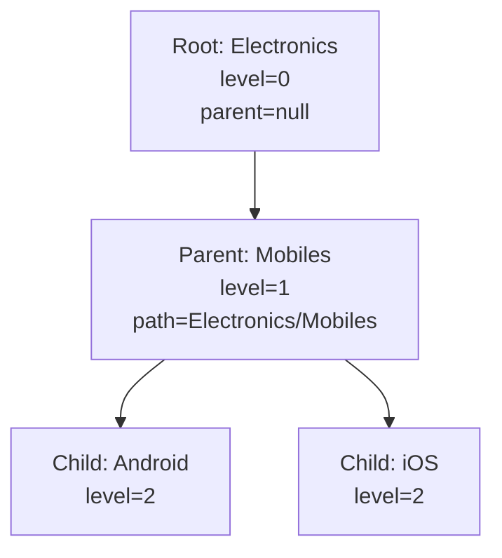
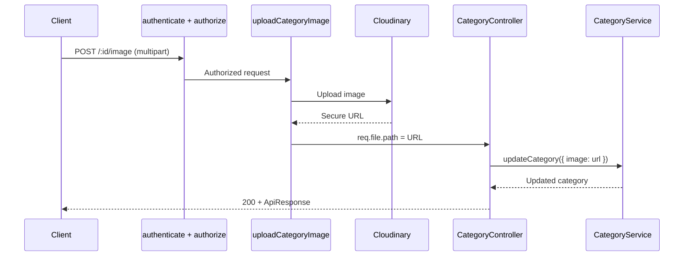
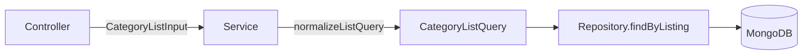
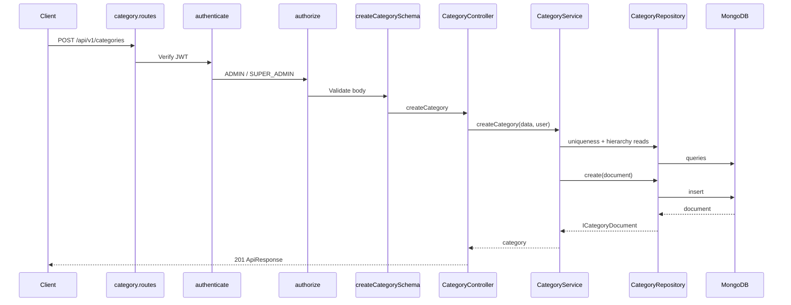
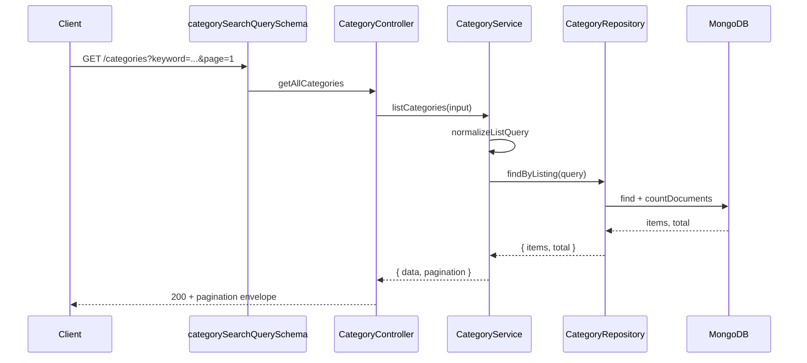
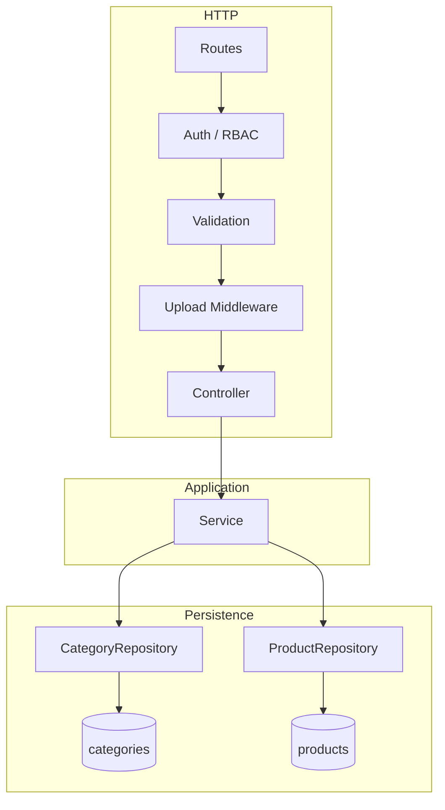
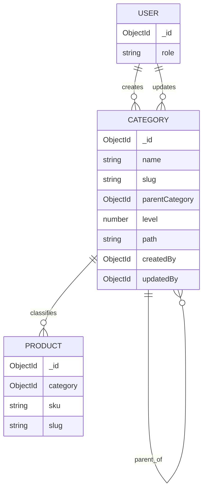

# Enterprise E-commerce — Category Module Developer Documentation

**Module:** Category Taxonomy (Step 9)  
**Stack:** Node.js · Express · TypeScript · MongoDB · Mongoose · JWT · RBAC · Cloudinary  
**Audience:** Backend engineers, tech leads, API consumers, QA  
**Document version:** 1.0  
**Base API path:** `/api/v1/categories`  
**Status:** Steps 9.1–9.9 completed

---

## Table of Contents

1. [Module Overview](#1-module-overview)
2. [Features](#2-features)
3. [Folder Structure](#3-folder-structure)
4. [Database Schema](#4-database-schema)
5. [Category Hierarchy](#5-category-hierarchy-root-parent-child)
6. [Repository Layer](#6-repository-layer)
7. [Service Layer](#7-service-layer)
8. [Controller Layer](#8-controller-layer)
9. [Validation Layer](#9-validation-layer)
10. [API Documentation](#10-api-documentation-all-endpoints)
11. [Image Upload](#11-image-upload-multer--cloudinary)
12. [Search, Filtering, Pagination & Sorting](#12-search-filtering-pagination--sorting)
13. [Authentication & RBAC](#13-authentication--rbac)
14. [Error Handling](#14-error-handling)
15. [Request Flow Diagram](#15-request-flow-diagram)
16. [Database Relationships](#16-database-relationships)
17. [Testing (Postman Examples)](#17-testing-postman-examples)
18. [Best Practices](#18-best-practices)
19. [Future Enhancements](#19-future-enhancements)
20. [Conclusion](#20-conclusion)

---

# 1. Module Overview

## 1.1 Purpose

The **Category Module** owns the hierarchical product taxonomy for the Enterprise E-commerce platform. It provides nested catalog navigation (root → parent → child), merchandising flags, SEO metadata, media, and safe admin mutations under JWT + RBAC.

It is designed as a modular vertical slice under `src/modules/category/`, following the same architectural contracts as the Product Module (Step 8): Repository → Service → Controller, thin HTTP adapters, and lean MongoDB reads.

## 1.2 Delivery Map (Step 9)

| Step | Capability | Status |
|------|------------|--------|
| 9.1 | Module foundation (DTO, constants, helpers, barrel) | ✅ |
| 9.2 | Category schema (`parentCategory`, `level`, `path`) | ✅ |
| 9.3 | Category Repository | ✅ |
| 9.4 | Category Service (hierarchy & uniqueness rules) | ✅ |
| 9.5 | Category Controller | ✅ |
| 9.6 | express-validator chains | ✅ |
| 9.7 | Public + Admin routes | ✅ |
| 9.8 | Cloudinary image upload | ✅ |
| 9.9 | Enterprise listing (search, filter, sort, pagination) | ✅ |

## 1.3 Architecture Principles

| Principle | Application |
|-----------|-------------|
| **SRP** | Repository = persistence; Service = business rules; Controller = HTTP |
| **DIP** | Service depends on repository abstractions injected at the composition root |
| **Consistency** | Listing envelope identical to Product (`data` + `pagination`) |
| **Reuse** | Shared upload middleware, auth, RBAC, and `ApiResponse` shape |
| **Safety** | Delete blocked when children or linked products exist |

## 1.4 Non-Objectives (Deferred)

- Soft delete / recycle bin
- Cloudinary asset deletion on category update
- Multi-language category names
- Elasticsearch / full-text ranking
- Redis caching of tree responses
- Public storefront-specific category APIs (beyond current GETs)

---

# 2. Features

| Feature | Description |
|---------|-------------|
| **CRUD** | Create, update, delete, and fetch categories by id or slug |
| **Hierarchy** | Self-referencing tree via `parentCategory`, `level`, and materialized `path` |
| **Roots & Children** | Dedicated endpoints for root nodes and direct children |
| **Nested Tree** | `GET /tree` returns a nested `children[]` structure |
| **Search** | Keyword match across `name`, `slug`, and `description` |
| **Filtering** | `parentCategory`, `level`, `isActive`, `isFeatured`, `createdBy` |
| **Sorting** | `name`, `sortOrder`, `createdAt`, `updatedAt` |
| **Pagination** | Product-identical meta: `total`, `page`, `limit`, `totalPages`, `hasNext`, `hasPrevious` |
| **Field selection** | Optional `fields=name,slug,image` projection |
| **Parent population** | Optional `populateParent=true` on listing |
| **Status / Featured / Sort** | Targeted PATCH endpoints for merchandising ops |
| **Image upload** | Single image via Multer + Cloudinary (`enterprise-ecommerce/categories`) |
| **RBAC** | Mutations restricted to `ADMIN` and `SUPER_ADMIN` |
| **Integrity** | Name uniqueness under same parent; global slug uniqueness; delete guards |

---

# 3. Folder Structure

```text
server/src/modules/category/
├── category.model.ts          # Mongoose schema + ICategoryDocument
├── category.repository.ts     # Data-access layer + listing query builder
├── category.service.ts        # Business rules, hierarchy, listing normalization
├── category.controller.ts     # Thin HTTP adapters
├── category.validation.ts     # express-validator chains
├── category.routes.ts         # Route wiring + DI composition root
├── index.ts                   # Public barrel exports
├── constants/
│   └── category.constants.ts  # Defaults and sort/status constants
├── dto/
│   ├── create-category.dto.ts
│   └── update-category.dto.ts
├── helpers/
│   └── category.helper.ts
└── interfaces/
    └── category.interface.ts

# Shared dependencies (outside module)
server/src/middleware/
├── auth.middleware.ts         # JWT authenticate
├── role.middleware.ts         # authorize(...roles)
└── upload.middleware.ts       # uploadCategoryImage

server/src/config/
└── cloudinary.ts

server/src/repositories/
└── product.repository.ts      # Used for delete-time product linkage checks

server/docs/
└── CATEGORY_MODULE_STEP_9.md  # This document
```

**Mount note:** Routes are designed for `/api/v1/categories` (see `category.routes.ts` header comment). Ensure the app composition root mounts `categoryRoutes` accordingly.

---

# 4. Database Schema

## 4.1 Collection

| Property | Value |
|----------|-------|
| Collection | `categories` |
| Model name | `Category` |
| Timestamps | `createdAt`, `updatedAt` |
| Version key | Disabled in JSON/object transforms |

## 4.2 Field Reference

| Field | Type | Required | Default | Notes |
|-------|------|----------|---------|-------|
| `name` | String | Yes | — | 2–100 chars, trimmed |
| `slug` | String | Yes | — | Unique, lowercase, max 120 |
| `description` | String | No | — | Max 1000 |
| `image` | String | No | — | Cloudinary URL |
| `parentCategory` | ObjectId \| null | No | `null` | Self-ref → `Category` |
| `level` | Number | No | `0` | Depth: 0 = root |
| `path` | String | No | `""` | Materialized path, e.g. `Electronics/Mobiles` |
| `sortOrder` | Number | No | `0` | Merchandising order |
| `isActive` | Boolean | No | `true` | Visibility flag |
| `isFeatured` | Boolean | No | `false` | Featured merchandising |
| `metaTitle` | String | No | — | SEO, max 150 |
| `metaDescription` | String | No | — | SEO, max 300 |
| `createdBy` | ObjectId | Yes | — | Ref → `User` |
| `updatedBy` | ObjectId | No | — | Ref → `User` |
| `childrenCount` | Virtual | — | — | Count of direct children |

## 4.3 Indexes

| Index | Purpose |
|-------|---------|
| `slug` (unique) | Fast slug lookup + uniqueness |
| `{ parentCategory: 1 }` | Children / root queries |
| `{ isActive: 1 }` | Active filtering |
| `{ sortOrder: 1 }` | Ordering |
| `{ parentCategory: 1, sortOrder: 1 }` | Ordered siblings under a parent |

## 4.4 Schema Snippet

```typescript
parentCategory: {
  type: Schema.Types.ObjectId,
  ref: "Category",
  default: null,
},
level: {
  type: Number,
  default: 0,
  min: [0, "Category level cannot be negative."],
},
path: {
  type: String,
  trim: true,
  default: "",
},
```

---

# 5. Category Hierarchy (Root, Parent, Child)

## 5.1 Concepts

| Term | Meaning |
|------|---------|
| **Root** | `parentCategory === null`, `level === 0` |
| **Parent** | Any category that has one or more children |
| **Child** | Category whose `parentCategory` points to another category |
| **Path** | Materialized breadcrumb string built on create/update |

## 5.2 Hierarchy Rules (Service)

1. Root categories start at `level = 0` and `path = <name>`.
2. Child categories inherit `level = parent.level + 1`.
3. Child path = `<parent.path>/<name>` (falls back to parent name if path empty).
4. A category **cannot** be its own parent.
5. **Name uniqueness** is enforced within the same parent (including among roots).
6. **Slug uniqueness** is global across all categories.
7. **Delete** is rejected if:
   - Direct children exist, or
   - Any product references the category (`productRepository.exists({ category })`).

## 5.3 Hierarchy Diagram



## 5.4 Example Documents

**Root**

```json
{
  "name": "Electronics",
  "slug": "electronics",
  "parentCategory": null,
  "level": 0,
  "path": "Electronics",
  "sortOrder": 1,
  "isActive": true
}
```

**Child**

```json
{
  "name": "Mobiles",
  "slug": "mobiles",
  "parentCategory": "687abc123def4567890abcde",
  "level": 1,
  "path": "Electronics/Mobiles",
  "sortOrder": 1,
  "isActive": true
}
```

---

# 6. Repository Layer

**File:** `category.repository.ts`  
**Responsibility:** MongoDB/Mongoose access only — no business rules, no HTTP.

## 6.1 Core Methods

| Method | Description |
|--------|-------------|
| `create` | Persist a new category |
| `findById` | Fetch by ObjectId (optional populate/projection) |
| `findBySlug` | Fetch by unique slug |
| `findAll` | Generic filtered find with optional page/limit/sort |
| `findByListing` | Enterprise listing: filter + sort + skip/limit + count |
| `updateById` | Update with validators; returns lean doc |
| `deleteById` | Hard delete |
| `existsByName` / `existsBySlug` | Existence checks |
| `findChildren` / `findRootCategories` / `findByParent` | Hierarchy helpers |
| `search` | Keyword `$or` across name/slug/description |
| `count` | Document count |
| `updateSortOrder` / `updateStatus` / `updateFeatured` | Targeted field updates |

## 6.2 Listing Internals

`findByListing(query)`:

1. Builds a Mongo filter from keyword + filters.
2. Maps `sortBy` / `sortDirection` to a sort document.
3. Applies `skip` / `limit`, optional `select(fields)`, optional `populate("parentCategory")`.
4. Runs `find` and `countDocuments` in parallel.
5. Uses `.lean()` for read performance.

```typescript
const [items, total] = await Promise.all([
  findQuery.lean<ICategoryDocument[]>().exec(),
  this.categoryModel.countDocuments(filter).exec(),
]);
```

---

# 7. Service Layer

**File:** `category.service.ts`  
**Responsibility:** Domain rules and orchestration. No Express types, no direct Mongoose queries.

## 7.1 Primary Use Cases

| Method | Behavior |
|--------|----------|
| `createCategory` | Normalize name/slug, assert uniqueness, resolve hierarchy, set `createdBy` |
| `updateCategory` | Re-validate uniqueness/hierarchy, set `updatedBy` |
| `deleteCategory` | Guard children + linked products, then hard delete |
| `getCategoryById` / `getCategoryBySlug` | Fetch with parent populated |
| `getAllCategories` | Non-listing filtered read (legacy/internal) |
| `listCategories` | Normalize query → repository listing → pagination meta |
| `searchCategories` | Requires keyword; delegates to `listCategories` |
| `getRootCategories` / `getChildren` / `getCategoryTree` | Hierarchy navigation |
| `updateCategoryStatus` / `updateFeaturedStatus` / `updateSortOrder` | Merchandising patches |

## 7.2 Listing Defaults

| Setting | Value |
|---------|-------|
| Default page | `1` |
| Default limit | `10` |
| Max limit | `100` |
| Default sortBy | `sortOrder` |
| Default sortOrder | `asc` |

## 7.3 Pagination Meta (Product-Identical)

```json
{
  "total": 125,
  "page": 1,
  "limit": 10,
  "totalPages": 13,
  "hasNext": true,
  "hasPrevious": false
}
```

## 7.4 Dependencies

```typescript
constructor(
  private readonly categoryRepository: CategoryRepository,
  private readonly productRepository: ProductRepository
) {}
```

`ProductRepository` is used solely for referential integrity on delete.

---

# 8. Controller Layer

**File:** `category.controller.ts`  
**Responsibility:** Extract request data, call service, return `ApiResponse`, forward errors via `next(error)`.

## 8.1 Design Rules

- Controllers stay **thin** — no uniqueness, hierarchy, or Mongo filter construction.
- Listing controller builds a `CategoryListInput` from query params only.
- Authenticated mutations use `requireUser(req, res)` to read `req.user._id`.
- Image upload reads Cloudinary URL from `req.file.path`.

## 8.2 Standard Success Envelope

```json
{
  "success": true,
  "message": "Categories fetched successfully.",
  "data": []
}
```

Listing endpoints additionally include `pagination`.

## 8.3 Handler Map

| Handler | HTTP | Notes |
|---------|------|-------|
| `createCategory` | POST `/` | 201 |
| `updateCategory` | PUT `/:id` | Full update payload |
| `deleteCategory` | DELETE `/:id` | Hard delete |
| `getCategoryById` | GET `/:id` | Populates parent |
| `getCategoryBySlug` | GET `/slug/:slug` | Populates parent |
| `getAllCategories` | GET `/` | Listing + pagination |
| `searchCategories` | GET `/search` | Keyword required |
| `getRootCategories` | GET `/roots` | Roots only |
| `getChildren` | GET `/:id/children` | Direct children |
| `getCategoryTree` | GET `/tree` | Nested tree |
| `updateCategoryStatus` | PATCH `/:id/status` | `{ isActive }` |
| `updateFeaturedStatus` | PATCH `/:id/featured` | `{ isFeatured }` |
| `updateSortOrder` | PATCH `/:id/sort-order` | `{ sortOrder }` |
| `uploadCategoryImage` | POST `/:id/image` | Multipart `image` |

---

# 9. Validation Layer

**File:** `category.validation.ts`  
**Library:** `express-validator`  
**Responsibility:** Request-shape validation only (no DB checks).

## 9.1 Schemas

| Schema | Applied to |
|--------|------------|
| `createCategorySchema` | POST `/` |
| `updateCategorySchema` | PUT `/:id` |
| `categoryIdParamSchema` | Routes with `:id` |
| `slugParamSchema` | GET `/slug/:slug` |
| `categorySearchQuerySchema` | GET `/`, GET `/search` |
| `updateStatusSchema` | PATCH `/:id/status` |
| `updateFeaturedSchema` | PATCH `/:id/featured` |
| `updateSortOrderSchema` | PATCH `/:id/sort-order` |

## 9.2 Create Body Rules (Summary)

| Field | Rules |
|-------|-------|
| `name` | Required, string, 2–100 |
| `slug` | Optional, lowercase, 2–120 |
| `description` | Optional, max 1000 |
| `image` | Optional URL |
| `parentCategory` | Optional ObjectId or null |
| `sortOrder` | Optional int ≥ 0 |
| `isFeatured` | Optional boolean |
| `metaTitle` / `metaDescription` | Optional length-capped strings |

## 9.3 Listing Query Rules (Summary)

| Query | Rules |
|-------|-------|
| `keyword` | Optional string |
| `page` | Optional int ≥ 1 (default 1) |
| `limit` | Optional int 1–100 (default 10) |
| `sortBy` | `name` \| `sortOrder` \| `createdAt` \| `updatedAt` |
| `sortOrder` | `asc` \| `desc` |
| `parentCategory` | ObjectId or `"null"` |
| `level` | Optional int ≥ 0 |
| `isActive` / `isFeatured` / `populateParent` | Optional boolean |
| `createdBy` | Optional ObjectId |
| `fields` | Comma-separated field names |

---

# 10. API Documentation (All Endpoints)

**Base URL:** `/api/v1/categories`

## 10.1 Endpoint Summary

| Method | Path | Auth | Roles | Description |
|--------|------|------|-------|-------------|
| GET | `/` | Public | — | List with search/filter/sort/pagination |
| GET | `/search` | Public | — | Keyword search (same listing envelope) |
| GET | `/tree` | Public | — | Nested category tree |
| GET | `/roots` | Public | — | Root categories only |
| GET | `/slug/:slug` | Public | — | Fetch by slug |
| GET | `/:id` | Public | — | Fetch by id |
| GET | `/:id/children` | Public | — | Direct children |
| POST | `/` | JWT | ADMIN, SUPER_ADMIN | Create category |
| PUT | `/:id` | JWT | ADMIN, SUPER_ADMIN | Update category |
| DELETE | `/:id` | JWT | ADMIN, SUPER_ADMIN | Delete category |
| PATCH | `/:id/status` | JWT | ADMIN, SUPER_ADMIN | Update `isActive` |
| PATCH | `/:id/featured` | JWT | ADMIN, SUPER_ADMIN | Update `isFeatured` |
| PATCH | `/:id/sort-order` | JWT | ADMIN, SUPER_ADMIN | Update `sortOrder` |
| POST | `/:id/image` | JWT | ADMIN, SUPER_ADMIN | Upload category image |

> Static paths (`/tree`, `/roots`, `/search`, `/slug/:slug`) are registered **before** `/:id`.

---

## 10.2 GET `/api/v1/categories`

List categories with optional keyword, filters, sort, pagination, fields, and parent population.

**Query examples**

```http
GET /api/v1/categories
GET /api/v1/categories?page=2&limit=20
GET /api/v1/categories?keyword=electronics
GET /api/v1/categories?isActive=true&isFeatured=true
GET /api/v1/categories?parentCategory=687abc123def4567890abcde
GET /api/v1/categories?level=1
GET /api/v1/categories?sortBy=name&sortOrder=asc
GET /api/v1/categories?fields=name,slug,image
GET /api/v1/categories?populateParent=true
GET /api/v1/categories?keyword=phone&isActive=true&page=1&limit=10
```

**Success response**

```json
{
  "success": true,
  "message": "Categories fetched successfully.",
  "data": [
    {
      "_id": "687abc123def4567890abcde",
      "name": "Electronics",
      "slug": "electronics",
      "parentCategory": null,
      "level": 0,
      "path": "Electronics",
      "sortOrder": 1,
      "isActive": true,
      "isFeatured": true
    }
  ],
  "pagination": {
    "total": 125,
    "page": 1,
    "limit": 10,
    "totalPages": 13,
    "hasNext": true,
    "hasPrevious": false
  }
}
```

---

## 10.3 GET `/api/v1/categories/search`

Same listing pipeline as `GET /`, but **keyword is required**.

```http
GET /api/v1/categories/search?keyword=phone&page=1&limit=10
```

```json
{
  "success": true,
  "message": "Categories search completed successfully.",
  "data": [],
  "pagination": {
    "total": 0,
    "page": 1,
    "limit": 10,
    "totalPages": 0,
    "hasNext": false,
    "hasPrevious": false
  }
}
```

---

## 10.4 GET `/api/v1/categories/tree`

Returns nested nodes with `children[]`.

```json
{
  "success": true,
  "message": "Category tree fetched successfully.",
  "data": [
    {
      "name": "Electronics",
      "slug": "electronics",
      "level": 0,
      "children": [
        {
          "name": "Mobiles",
          "slug": "mobiles",
          "level": 1,
          "children": []
        }
      ]
    }
  ]
}
```

---

## 10.5 GET `/api/v1/categories/roots`

```json
{
  "success": true,
  "message": "Root categories fetched successfully.",
  "data": []
}
```

---

## 10.6 GET `/api/v1/categories/slug/:slug`

```http
GET /api/v1/categories/slug/electronics
Authorization: (not required)
```

---

## 10.7 GET `/api/v1/categories/:id`

```http
GET /api/v1/categories/687abc123def4567890abcde
```

---

## 10.8 GET `/api/v1/categories/:id/children`

```http
GET /api/v1/categories/687abc123def4567890abcde/children
```

```json
{
  "success": true,
  "message": "Child categories fetched successfully.",
  "data": []
}
```

---

## 10.9 POST `/api/v1/categories`

**Headers**

```http
Authorization: Bearer <access_token>
Content-Type: application/json
```

**Body**

```json
{
  "name": "Electronics",
  "slug": "electronics",
  "description": "Consumer electronics",
  "parentCategory": null,
  "sortOrder": 1,
  "isFeatured": true,
  "metaTitle": "Electronics",
  "metaDescription": "Shop electronics"
}
```

**Success (201)**

```json
{
  "success": true,
  "message": "Category created successfully.",
  "data": {
    "_id": "...",
    "name": "Electronics",
    "slug": "electronics",
    "level": 0,
    "path": "Electronics",
    "createdBy": "..."
  }
}
```

---

## 10.10 PUT `/api/v1/categories/:id`

At least one updatable field is required.

```json
{
  "name": "Consumer Electronics",
  "isActive": true
}
```

```json
{
  "success": true,
  "message": "Category updated successfully.",
  "data": {}
}
```

---

## 10.11 DELETE `/api/v1/categories/:id`

```json
{
  "success": true,
  "message": "Category deleted successfully.",
  "data": {}
}
```

**Failure examples**

- `"Cannot delete category while child categories exist."`
- `"Cannot delete category while products are linked to it."`

---

## 10.12 PATCH `/api/v1/categories/:id/status`

```json
{ "isActive": false }
```

---

## 10.13 PATCH `/api/v1/categories/:id/featured`

```json
{ "isFeatured": true }
```

---

## 10.14 PATCH `/api/v1/categories/:id/sort-order`

```json
{ "sortOrder": 10 }
```

---

## 10.15 POST `/api/v1/categories/:id/image`

**Content-Type:** `multipart/form-data`  
**Field name:** `image` (single file)

```json
{
  "success": true,
  "message": "Category image uploaded successfully.",
  "data": {
    "_id": "...",
    "image": "https://res.cloudinary.com/.../categories/...."
  }
}
```

---

# 11. Image Upload (Multer + Cloudinary)

## 11.1 Shared Middleware

**File:** `src/middleware/upload.middleware.ts`  
**Export:** `uploadCategoryImage`

| Setting | Value |
|---------|-------|
| Storage | `multer-storage-cloudinary` |
| Cloudinary folder | `enterprise-ecommerce/categories` |
| Field | `image` (`.single("image")`) |
| Allowed MIME | `jpeg`, `jpg`, `png`, `webp` |
| Max size | 5 MB |
| URL location | `req.file.path` (secure Cloudinary URL) |

## 11.2 Upload Flow



## 11.3 Environment Variables

```env
CLOUDINARY_CLOUD_NAME=your_cloud_name
CLOUDINARY_API_KEY=your_api_key
CLOUDINARY_API_SECRET=your_api_secret
```

## 11.4 Notes

- Product and Category share MIME allow-list and size limits.
- Uploading replaces the stored URL on the category document; Cloudinary orphan cleanup is a future enhancement.
- Local disk storage is not used in production path.

---

# 12. Search, Filtering, Pagination & Sorting

## 12.1 Search

| Aspect | Detail |
|--------|--------|
| Param | `keyword` (also accepts `search` in controller mapping) |
| Fields | `name`, `slug`, `description` |
| Match | Case-insensitive RegExp (`$or`) |
| Safety | User input escaped before RegExp construction |

## 12.2 Filters

| Param | Type | Behavior |
|-------|------|----------|
| `parentCategory` | ObjectId \| `null` | Exact parent; `"null"` → root filter |
| `level` | number | Exact hierarchy depth |
| `isActive` | boolean | Active flag |
| `isFeatured` | boolean | Featured flag |
| `createdBy` | ObjectId | Creator user id |

## 12.3 Sorting

| `sortBy` | Description |
|----------|-------------|
| `name` | Alphabetical |
| `sortOrder` | Merchandising order (**default**) |
| `createdAt` | Creation time |
| `updatedAt` | Last update time |

| `sortOrder` | Direction |
|-------------|-----------|
| `asc` | Ascending (**default**) |
| `desc` | Descending |

## 12.4 Pagination

| Param | Default | Max |
|-------|---------|-----|
| `page` | 1 | — |
| `limit` | 10 | 100 |

Meta fields: `total`, `page`, `limit`, `totalPages`, `hasNext`, `hasPrevious`.

## 12.5 Field Selection & Populate

```http
GET /api/v1/categories?fields=name,slug,image&populateParent=true
```

- `fields` → Mongoose `select`
- `populateParent=true` → populates `parentCategory` (opt-in; mirrors Product listing’s lean, non-default population style)

## 12.6 Layer Split



---

# 13. Authentication & RBAC

## 13.1 Roles

Defined in `src/constants/roles.ts`:

| Role | Mutations on Category |
|------|------------------------|
| `SUPER_ADMIN` | Allowed |
| `ADMIN` | Allowed |
| `VENDOR` | Denied |
| `CUSTOMER` | Denied |
| `DELIVERY_BOY` | Denied |

Public **GET** endpoints do not require authentication.

## 13.2 Middleware Stack (Mutations)

```text
authenticate → authorize(ROLES.ADMIN, ROLES.SUPER_ADMIN) → validators → controller
```

Image upload inserts `uploadCategoryImage` after param validation:

```text
authenticate → authorize(...) → categoryIdParamSchema → uploadCategoryImage → controller
```

## 13.3 Actor Tracking

| Operation | Field set |
|-----------|-----------|
| Create | `createdBy = req.user._id` |
| Update / image upload | `updatedBy = req.user._id` |

## 13.4 Authorization Header

```http
Authorization: Bearer <access_token>
```

Unauthorized requests receive:

```json
{
  "success": false,
  "message": "Unauthorized"
}
```

---

# 14. Error Handling

## 14.1 Pattern

1. Service throws domain `Error` with a clear message.
2. Controller catches and calls `next(error)`.
3. Global error middleware maps to HTTP responses (project-standard).

## 14.2 Common Domain Errors

| Message | Typical cause |
|---------|---------------|
| `Category not found.` | Invalid id/slug or race on update/delete |
| `Parent category not found.` | Invalid `parentCategory` |
| `A category cannot be its own parent.` | Self-reference on update |
| `A root category with this name already exists.` | Duplicate root name |
| `A category with this name already exists under the same parent.` | Sibling name clash |
| `Category with this slug already exists.` | Global slug conflict |
| `Cannot delete category while child categories exist.` | Hierarchy guard |
| `Cannot delete category while products are linked to it.` | Product FK guard |
| `Search keyword is required.` | `/search` without keyword |
| `Invalid sortBy. Allowed: ...` | Unsupported sort field |
| `Category image file is required.` | Missing multipart file (400 from controller) |

## 14.3 Validation Errors

express-validator failures should be surfaced by the shared validation result middleware (same pattern as Product). Clients should expect field-level messages such as:

- `"Category name is required."`
- `"Limit must be an integer between 1 and 100."`
- `"sortBy must be one of: name, sortOrder, createdAt, updatedAt."`

---

# 15. Request Flow Diagram

## 15.1 Create Category (Admin)



## 15.2 List Categories (Public)



## 15.3 End-to-End Layering



---

# 16. Database Relationships

## 16.1 Entity Relationship Diagram



## 16.2 Relationship Details

| Relationship | Field | Cardinality | Notes |
|--------------|-------|-------------|-------|
| Category → Category | `parentCategory` | Many → One (nullable) | Self-referencing tree |
| Category → User | `createdBy` | Many → One | Required on create |
| Category → User | `updatedBy` | Many → One | Set on mutations |
| Product → Category | `product.category` | Many → One | Blocks category delete when present |

## 16.3 Virtual Relationship

`childrenCount` is a virtual count of documents where `parentCategory = this._id`. It is available when virtuals are enabled (`toJSON` / `toObject`).

---

# 17. Testing (Postman Examples)

Assume base URL:

```text
{{baseUrl}} = http://localhost:5000/api/v1
{{token}}   = <ADMIN or SUPER_ADMIN access token>
```

## 17.1 Create Root Category

```http
POST {{baseUrl}}/categories
Authorization: Bearer {{token}}
Content-Type: application/json

{
  "name": "Electronics",
  "description": "All electronics",
  "sortOrder": 1,
  "isFeatured": true
}
```

## 17.2 Create Child Category

```http
POST {{baseUrl}}/categories
Authorization: Bearer {{token}}
Content-Type: application/json

{
  "name": "Mobiles",
  "parentCategory": "{{electronicsId}}",
  "sortOrder": 1
}
```

## 17.3 List with Filters

```http
GET {{baseUrl}}/categories?keyword=mobile&isActive=true&sortBy=sortOrder&sortOrder=asc&page=1&limit=10
```

## 17.4 Search Endpoint

```http
GET {{baseUrl}}/categories/search?keyword=electronics&limit=5
```

## 17.5 Fetch Tree / Roots / Children

```http
GET {{baseUrl}}/categories/tree
GET {{baseUrl}}/categories/roots
GET {{baseUrl}}/categories/{{electronicsId}}/children
```

## 17.6 Update Status / Featured / Sort

```http
PATCH {{baseUrl}}/categories/{{categoryId}}/status
Authorization: Bearer {{token}}
Content-Type: application/json

{ "isActive": false }
```

```http
PATCH {{baseUrl}}/categories/{{categoryId}}/featured
Authorization: Bearer {{token}}
Content-Type: application/json

{ "isFeatured": true }
```

```http
PATCH {{baseUrl}}/categories/{{categoryId}}/sort-order
Authorization: Bearer {{token}}
Content-Type: application/json

{ "sortOrder": 5 }
```

## 17.7 Upload Image (Postman)

1. Method: `POST`
2. URL: `{{baseUrl}}/categories/{{categoryId}}/image`
3. Auth: Bearer token
4. Body → form-data
5. Key: `image` (type: **File**)
6. Value: select a `.jpg` / `.png` / `.webp` under 5 MB

## 17.8 Delete Guards

```http
DELETE {{baseUrl}}/categories/{{parentWithChildrenId}}
Authorization: Bearer {{token}}
```

Expected: error when children exist.

```http
DELETE {{baseUrl}}/categories/{{categoryLinkedToProductId}}
Authorization: Bearer {{token}}
```

Expected: error when products reference the category.

## 17.9 Suggested Postman Collection Folders

| Folder | Requests |
|--------|----------|
| Public Reads | list, search, tree, roots, by id, by slug, children |
| Admin Writes | create, update, delete |
| Merchandising | status, featured, sort-order, image |
| Negative Cases | unauthorized, invalid id, duplicate slug, delete guards |

---

# 18. Best Practices

1. **Keep layers pure** — never put Mongo filters in controllers or HTTP concerns in the service.
2. **Prefer listing APIs for catalogs** — use `GET /categories` with query params instead of fetching all and filtering in memory.
3. **Use lean reads** — listing and most fetches already use `.lean()` for performance.
4. **Register static routes first** — `/tree`, `/roots`, `/search`, `/slug/:slug` before `/:id`.
5. **Preserve hierarchy integrity** — always create children with a valid parent; never orphan via unsafe raw updates.
6. **Delete carefully** — move or delete children, and reassign/remove products before deleting a category.
7. **Reuse shared middleware** — do not fork Multer/Cloudinary config per module.
8. **Escape search input** — repository already escapes RegExp metacharacters; keep that contract if extending search.
9. **Bound pagination** — never allow unbounded `limit` (hard max: 100).
10. **Align with Product** — when extending listing meta or response envelopes, update Category and Product together.
11. **Store CDN URLs only** — persist Cloudinary URLs; do not store local temp paths.
12. **Document actor fields** — always set `createdBy` / `updatedBy` for auditability.

---

# 19. Future Enhancements

| Enhancement | Value |
|-------------|-------|
| Soft delete + restore | Safer catalog operations and audit recovery |
| Cloudinary cleanup jobs | Remove orphaned assets after image replace/delete |
| Breadcrumb API | Return path segments as structured array |
| Move subtree / reparent with path rebuild | Bulk hierarchy maintenance |
| Multi-language names | International storefronts |
| Redis cache for `/tree` and `/roots` | Lower latency for hot navigation endpoints |
| Elasticsearch / Atlas Search | Ranked full-text search at scale |
| Category analytics | Product counts, conversion by category |
| Bulk import/export | CSV/JSON taxonomy onboarding |
| OpenAPI (Swagger) generation | Contract-first client SDKs |
| Event publishing | Emit `category.created/updated/deleted` for search index sync |

---

# 20. Conclusion

The Enterprise Category Module (Steps **9.1–9.9**) delivers a production-ready taxonomy subsystem aligned with the Product Module architecture:

- Clear modular boundaries (repository / service / controller / validation / routes)
- Hierarchical modeling with `parentCategory`, `level`, and materialized `path`
- Safe admin mutations under JWT authentication and RBAC (`ADMIN`, `SUPER_ADMIN`)
- Cloudinary-backed image upload via shared Multer middleware
- Enterprise listing with search, filters, sorting, pagination, field selection, and optional parent population
- Referential integrity against child categories and linked products

With this foundation, the platform can power nested navigation, merchandising controls, and catalog governance while remaining consistent, testable, and extensible for future search, caching, and internationalization workstreams.

---

## Document Control

| Item | Value |
|------|-------|
| Module path | `server/src/modules/category/` |
| Related docs | `server/docs/PRODUCT_MODULE_STEP_8.md` |
| API base | `/api/v1/categories` |
| Version | 1.0 |
| Last updated | August 2026 |

---

*End of Category Module Developer Documentation*
