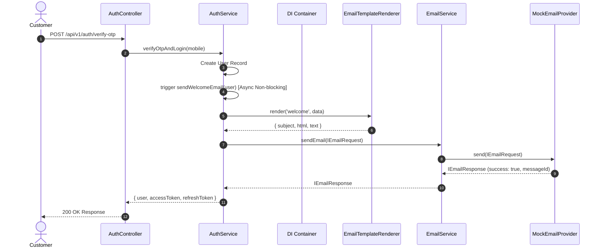

# Module 20.7 — Welcome Email Integration & End-to-End Testing

## Executive Summary

This document details the registration flow integration, central Dependency Injection wiring, and End-to-End pipeline verification for **Module 20.7 — Welcome Email Integration & End-to-End Testing**. By connecting `EmailService` and `EmailTemplateRenderer` into `AuthService` via Dependency Injection, newly created user accounts trigger a non-blocking Welcome Email dispatch rendered by `WelcomeEmailTemplate` and simulated via `MockEmailProvider`.

---

## 1. End-to-End Email Dispatch Flow



---

## 2. Centralized DI Container Singletons

Location: `src/container/index.ts`

```typescript
export const mockEmailProvider = new MockEmailProvider();
export const emailService = new EmailService(mockEmailProvider);
export const emailTemplateRenderer = new EmailTemplateRenderer();
export const welcomeEmailTemplate = new WelcomeEmailTemplate();

// Register Welcome Email template in Template Renderer engine
emailTemplateRenderer.registerTemplate(welcomeEmailTemplate);

export const authService = new AuthService(
  jwtService,
  sessionService,
  emailService,
  emailTemplateRenderer
);
```

---

## 3. Non-Blocking Delivery Guarantee

Location: `src/services/auth.service.ts`

```typescript
// Inside verifyOtpAndLogin() on user creation:
user = await User.create({ mobile, isVerified: true });

// Non-blocking Welcome Email dispatch on user creation
this.sendWelcomeEmail(user).catch((err) => {
  console.error("❌ Non-blocking welcome email delivery failure:", err.message || err);
});
```

* **Zero Registration Impact:** Exceptions thrown during template rendering or provider delivery are caught silently and logged without interrupting user account creation or API HTTP response status.
* **Loose Coupling:** `AuthService` depends strictly on abstractions (`IEmailService`, `ITemplateRenderer`) without referencing vendor drivers (SMTP, SES, SendGrid).

---

## 4. End-to-End Verification Results

Location: `src/modules/email/test/welcome-email.e2e.spec.ts`

* **Template Registration:** Verified template `EmailTemplateId.WELCOME` registered in `EmailTemplateRenderer`.
* **Rendering Engine:** Verified subject interpolation, HTML layout assembly, and plain-text fallback generation.
* **Provider Dispatch:** Verified `EmailService` delegates dispatch to `MockEmailProvider` and returns 200 OK `IEmailResponse`.
* **TypeScript Strictness (`npx tsc --noEmit`):** Executed — **0 Errors**.

---

## 5. Production Readiness Review

1. **Clean Architecture Boundaries:** Auth Service $\rightarrow$ Email Service $\rightarrow$ Mock Email Provider. Zero leakage of provider-specific SDKs into domain business rules.
2. **SOLID Principles:**
   * **Single Responsibility Principle (SRP):** Auth Service manages sessions and authentication; Template Engine manages template compilation; Mock Provider simulates delivery.
   * **Open/Closed Principle (OCP):** Swapping Mock Provider for Nodemailer, SES, or SendGrid requires updating singletons in `src/container/index.ts` without modifying `AuthService` code.
3. **Resilience & Scalability:** Non-blocking async execution prevents external email vendor latency from degrading authentication API performance.
