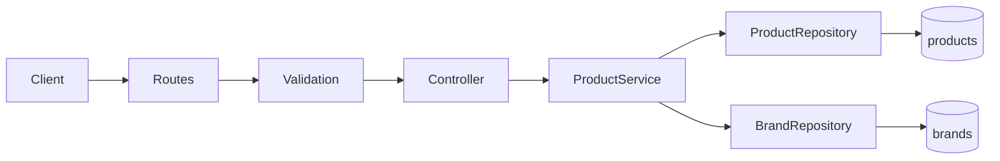
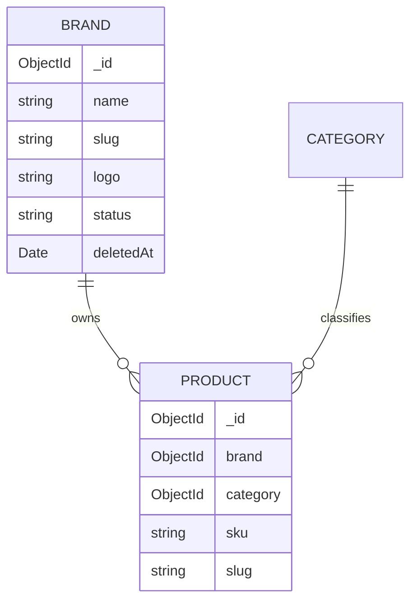

# Enterprise E-commerce — Module 11: Product ↔ Brand Integration

**Module:** Product ↔ Brand Integration (Day 8 / Module 11)  
**Stack:** Node.js · Express · TypeScript · MongoDB · Mongoose · JWT · RBAC  
**Audience:** Backend engineers, tech leads, API consumers, QA, handover recipients  
**Document version:** 1.0  
**Related modules:** Product (Step 8), Brand (Module 10), Category (Module 9)  
**Status:** Steps 11.1–11.7 completed

---

## Table of Contents

1. [Module Overview](#1-module-overview)
2. [Objectives](#2-objectives)
3. [Architecture](#3-architecture)
4. [Product ↔ Brand Relationship](#4-product--brand-relationship)
5. [Step 11.1 – Product Schema Update](#5-step-111--product-schema-update)
6. [Step 11.2 – Product Validation](#6-step-112--product-validation)
7. [Step 11.3 – Brand Existence Validation](#7-step-113--brand-existence-validation)
8. [Step 11.4 – Populate Brand Details](#8-step-114--populate-brand-details)
9. [Step 11.5 – Brand-based Product Filtering](#9-step-115--brand-based-product-filtering)
10. [Step 11.6 – Populated Brand in Create & Update Responses](#10-step-116--populated-brand-in-create--update-responses)
11. [Step 11.7 – End-to-End Testing](#11-step-117--end-to-end-testing)
12. [API Changes](#12-api-changes)
13. [Validation Rules](#13-validation-rules)
14. [Error Handling](#14-error-handling)
15. [Database Changes](#15-database-changes)
16. [Testing Scenarios](#16-testing-scenarios)
17. [Best Practices](#17-best-practices)
18. [Summary](#18-summary)

---

# 1. Module Overview

## 1.1 Purpose

Module 11 integrates the completed **Brand** catalog with the existing **Product** module so every sellable product is associated with exactly one brand. Integration covers:

- Required schema reference (`Product.brand` → `Brand`)
- Request validation for Mongo ObjectIds
- Service-layer existence and ACTIVE-status checks
- Selective Mongoose `populate()` on Product reads and writes
- Brand query filtering within the existing Product listing pipeline

This module does **not** introduce a new API surface for brand-product linking. It extends Product create, update, detail, and listing contracts already exposed under `/api/v1/products`.

## 1.2 Delivery Map

| Step | Capability | Status |
|------|------------|--------|
| 11.1 | Product schema: required `brand` ObjectId + index | ✅ |
| 11.2 | Create/update validation for `brand` | ✅ |
| 11.3 | Service-layer Brand existence + ACTIVE check | ✅ |
| 11.4 | Selective Brand populate on Product queries | ✅ |
| 11.5 | `?brand=` filter in Product listing | ✅ |
| 11.6 | Populated Brand on create/update responses | ✅ |
| 11.7 | End-to-end verification | ✅ |

## 1.3 Prerequisites

| Dependency | Status |
|------------|--------|
| Authentication / JWT / RBAC | Completed |
| Product Module (CRUD, listing, media) | Completed |
| Category Module | Completed |
| Brand Module (schema, soft delete, status, repository) | Completed |

---

# 2. Objectives

1. **Enforce catalog integrity** — every Product must reference a valid Brand.  
2. **Reject invalid or inactive brands** — soft-deleted and `INACTIVE` brands are not assignable.  
3. **Enrich Product API payloads** — clients receive Brand `_id`, `name`, `slug`, and `logo` without extra round-trips.  
4. **Enable Brand-based discovery** — filter Product listing by `brand` while reusing search, category, pagination, and sort.  
5. **Preserve enterprise layering** — schema, validation, service, and repository changes remain separated (SRP).  
6. **Avoid regressions** — existing Product, Category, Auth, and Brand behaviors remain intact.

**Non-objectives (deferred)**

- Multi-brand products  
- Automatic Product unlink on Brand soft delete  
- Public storefront-specific Brand facets  
- Global HTTP 404 error middleware (observed gap; see Testing)

---

# 3. Architecture

## 3.1 Layer Responsibilities for Integration



| Layer | Integration role |
|-------|------------------|
| **Schema** | Declares required `brand` ObjectId ref to `Brand` |
| **Validation** | Ensures request shape (required/optional ObjectId) |
| **Service** | Verifies Brand exists and is `ACTIVE` before persist |
| **Repository** | Applies Brand filter; populates Brand on reads/writes |
| **Controller / Routes** | Unchanged contracts; listing already passes `brand` query |

## 3.2 Dependency Injection

`ProductService` depends on both:

- `ProductRepository` — Product persistence and listing  
- `BrandRepository` — Brand lookup for existence/ACTIVE checks  

Composition root (`product.routes.ts`) wires:

```text
ProductRepository + BrandRepository → ProductService → ProductController
```

## 3.3 Design Principles

| Principle | Application |
|-----------|-------------|
| **DIP** | Product service uses Brand repository API, not Brand model queries |
| **Reuse** | Listing filter pipeline and `findById` populate path are shared |
| **Least privilege of data** | Populate selects only `_id name slug logo` |
| **Consistency** | Response envelope `{ success, message, data }` unchanged |

---

# 4. Product ↔ Brand Relationship

## 4.1 Cardinality



| Side | Cardinality | Meaning |
|------|-------------|---------|
| Brand → Product | One → Many | One brand may label many products |
| Product → Brand | Many → One | Each product belongs to exactly one brand |

## 4.2 Runtime Representation

**Persisted in MongoDB**

```json
{
  "brand": "ObjectId(\"...\")"
}
```

**Returned by Product APIs (after populate)**

```json
{
  "brand": {
    "_id": "...",
    "name": "Apple",
    "slug": "apple",
    "logo": "https://res.cloudinary.com/.../logo.png"
  }
}
```

## 4.3 Soft Delete Interaction

Brand model query middleware excludes documents where `deletedAt != null`. Product service Brand lookups therefore never resolve soft-deleted brands. Inactive (`INACTIVE`) brands are also rejected by service policy even if still present in the database.

---

# 5. Step 11.1 – Product Schema Update

**Files**

- `src/models/product.model.ts`
- `src/interfaces/product.interface.ts`

## 5.1 Schema Field

```typescript
brand: {
  type: Schema.Types.ObjectId,
  ref: "Brand",
  required: [true, "Product brand is required."],
  index: true,
}
```

## 5.2 Interface

```typescript
brand: Types.ObjectId;
```

Previously optional (`brand?:`), now required at the TypeScript contract level.

## 5.3 Index Hygiene

An initial duplicate index warning (`{"brand":1}`) was resolved by keeping `index: true` on the path and removing a redundant `productSchema.index({ brand: 1 })` declaration. Functionality unchanged.

## 5.4 Populate Readiness

`ref: "Brand"` enables:

```typescript
Product.find().populate("brand")
```

No populate code was added in Step 11.1 (deferred to 11.4 / 11.6).

---

# 6. Step 11.2 – Product Validation

**File:** `src/validators/product.validator.ts`

## 6.1 Create Product

| Rule | Message |
|------|---------|
| `brand` required | `"Brand is required."` |
| Must be Mongo ObjectId | `"Invalid Brand ID."` |

## 6.2 Update Product

| Rule | Message |
|------|---------|
| `brand` optional | — |
| If present, must be ObjectId | `"Invalid Brand ID."` |

## 6.3 Scope Boundary

Validation checks **shape only**. It does not query MongoDB for Brand existence (handled in Step 11.3).

---

# 7. Step 11.3 – Brand Existence Validation

**Files**

- `src/services/product.service.ts`
- `src/routes/product.routes.ts` (DI wiring only)

## 7.1 Service Rules

Before create:

1. Require `data.brand`.  
2. Call `assertBrandExistsAndActive(brandId)`.

Before update:

1. If `data.brand` is present, run the same assertion.  
2. If `brand` is omitted, skip Brand validation.

## 7.2 Assertion Logic

```typescript
private async assertBrandExistsAndActive(brandId): Promise<void> {
  const brand = await this.brandRepository.findById(brandId);

  if (!brand || brand.status !== BrandStatus.ACTIVE) {
    throw new Error("Brand not found.");
  }
}
```

| Condition | Result |
|-----------|--------|
| Missing / unknown ObjectId | `"Brand not found."` |
| Soft-deleted brand | Not returned by repository → `"Brand not found."` |
| `INACTIVE` brand | `"Brand not found."` |
| `ACTIVE` brand | Continues create/update |

## 7.3 Reuse

Uses existing `BrandRepository.findById` — no duplicate Brand query helpers were added.

---

# 8. Step 11.4 – Populate Brand Details

**File:** `src/repositories/product.repository.ts`

## 8.1 Shared Populate Config

```typescript
const BRAND_POPULATE = {
  path: "brand",
  select: "_id name slug logo",
} as const;
```

## 8.2 Applied On

| Method | Purpose |
|--------|---------|
| `findById` | Product details |
| `findBySku` | SKU lookup |
| `findBySlug` | Slug lookup |
| `findAll` | Generic filtered reads |
| `findByListing` | Search / filter / pagination listing |
| `create` / `updateById` | Write responses (finalized in 11.6) |
| `deleteById` | Deleted document payload |

## 8.3 Fields Excluded from Populate

Intentionally **not** returned:

- `status`, `deletedAt`, `createdBy`, `updatedBy`
- SEO fields, website, description
- Timestamps / version key / internal metadata

---

# 9. Step 11.5 – Brand-based Product Filtering

## 9.1 Query Parameter

```http
GET /api/v1/products?brand=<brandId>
```

## 9.2 Pipeline

| Layer | Behavior |
|-------|----------|
| Controller | Reads `req.query.brand` via `getQueryString` |
| Service | Trims empty values; passes through listing normalization |
| Repository | `if (query.brand) filter.brand = new ObjectId(query.brand)` |

Empty or missing `brand` does **not** modify the Mongo filter.

## 9.3 Composability

Brand filter works with existing listing capabilities:

| Combined example | Intent |
|------------------|--------|
| `?brand=...&category=...` | Brand + category |
| `?brand=...&search=iphone` | Brand + text search |
| `?brand=...&page=1&limit=10` | Brand + pagination |
| `?brand=...&sort=priceAsc` | Brand + sort |

Uses the existing Product `brand` index — no extra queries or collections.

---

# 10. Step 11.6 – Populated Brand in Create & Update Responses

## 10.1 Strategy

To avoid duplicating populate configuration:

1. **Create** — insert document, then return `findById(created._id)` (populated).  
2. **Update** — `findByIdAndUpdate`, then return `findById(id)` (populated).

## 10.2 Response Envelope

Unchanged:

```json
{
  "success": true,
  "message": "Product created successfully.",
  "data": {
    "...": "...",
    "brand": {
      "_id": "...",
      "name": "Apple",
      "slug": "apple",
      "logo": "..."
    }
  }
}
```

Only the `brand` field shape changes from ObjectId to populated object.

---

# 11. Step 11.7 – End-to-End Testing

## 11.1 Verification Approach

Service-layer verification against MongoDB covered create, invalid brand, update, listing populate, detail populate, brand filter, combined filters, and slug lookup.

**Result:** 11/11 checks passed.

## 11.2 Cleanup Performed During Verification

| Item | Action |
|------|--------|
| Duplicate imports / commented debug in `server.ts` | Cleaned |
| Brand schema middleware (`next is not a function` under Mongoose 9) | Fixed to sync hooks without callback `next` |
| Temporary verification script | Executed and removed |

## 11.3 Known Observations

| Observation | Impact |
|-------------|--------|
| No global error middleware mapping `"Brand not found."` → HTTP 404 | Domain message is correct; HTTP status may remain 500 until a mapper is added |
| Brand/Category routes not mounted in `app.ts` | Product ↔ Brand service integration still verifies; Brand HTTP APIs need mounting for full HTTP E2E |
| Product listing requires ADMIN/SUPER_ADMIN | Matches existing Product RBAC |

---

# 12. API Changes

Base path remains `/api/v1/products`. No new endpoints were added.

| Endpoint | Change |
|----------|--------|
| `POST /products` | Requires `brand`; response includes populated Brand |
| `PUT /products/:id` | Optional `brand`; if set, validated; response populated |
| `GET /products` | Supports `?brand=`; each item includes populated Brand |
| `GET /products/:id` | Brand populated |
| `GET /products/slug/:slug` | Brand populated |
| `GET /products/sku/:sku` | Brand populated |

### Example: Create Request

```http
POST /api/v1/products
Authorization: Bearer <access_token>
Content-Type: application/json
```

```json
{
  "name": "iPhone 15",
  "slug": "iphone-15",
  "sku": "IP15-128",
  "price": 79999,
  "quantity": 50,
  "category": "687cafegoryidxxxxxxxxxxxx",
  "brand": "687brandobjectidxxxxxxxxxxxx"
}
```

### Example: Listing with Brand Filter

```http
GET /api/v1/products?brand=687brandobjectidxxxxxxxxxxxx&search=iphone&page=1&limit=10
Authorization: Bearer <access_token>
```

---

# 13. Validation Rules

| Context | Field | Required | Type rule | Message |
|---------|-------|----------|-----------|---------|
| Create | `brand` | Yes | Mongo ObjectId | Brand is required. / Invalid Brand ID. |
| Update | `brand` | No | Mongo ObjectId if present | Invalid Brand ID. |

Validation does **not** replace service existence checks. Both layers are required:

1. Validation → request shape  
2. Service → domain existence / ACTIVE status  

---

# 14. Error Handling

## 14.1 Domain Errors

| Message | When |
|---------|------|
| `Brand not found.` | Missing brand on create; unknown id; soft-deleted; inactive |
| `Product not found.` | Existing Product domain errors unchanged |
| SKU / slug uniqueness errors | Unchanged |

## 14.2 Pattern

Controllers continue to forward errors with `next(error)`. Message text is enterprise-consistent with Category/Product not-found style.

## 14.3 Recommended Follow-up

Add a global error handler that maps messages containing `not found` (or a typed domain error) to HTTP **404**, so Step 11.3’s intended status is reflected at the HTTP boundary.

---

# 15. Database Changes

## 15.1 Product Collection

| Change | Detail |
|--------|--------|
| Field | `brand: ObjectId` (required) |
| Reference | `ref: "Brand"` |
| Index | Single index on `brand` via path `index: true` |

## 15.2 Brand Collection

No schema redesign for Module 11. Product integration consumes:

- Soft-delete middleware (`deletedAt`)
- `status` enum (`ACTIVE` / `INACTIVE`)
- Existing unique indexes on Brand `name` / `slug`

## 15.3 Migration Note

Existing Product documents without `brand` will fail schema validation on save until backfilled. Plan a data migration before enforcing required brand in production datasets.

---

# 16. Testing Scenarios

| # | Scenario | Expected |
|---|----------|----------|
| 1 | Create Product with valid ACTIVE Brand | 201/success; populated brand |
| 2 | Create with non-existent Brand ObjectId | Error: Brand not found. |
| 3 | Create with INACTIVE Brand | Error: Brand not found. |
| 4 | Create with soft-deleted Brand | Error: Brand not found. |
| 5 | Update Product brand to another ACTIVE Brand | Success; populated new brand |
| 6 | Update with invalid Brand | Error: Brand not found. |
| 7 | Update without brand field | No Brand check; other fields update |
| 8 | GET Product by id | brand `{ _id, name, slug, logo }` |
| 9 | GET Product listing | Each item populated |
| 10 | GET `?brand=<id>` | Only matching products |
| 11 | Brand + category + search + page | Combined filters work |
| 12 | Slug lookup | Still works; brand populated |
| 13 | Category/status/price filters without brand | No regression |

---

# 17. Best Practices

1. **Keep Brand checks in the service** — validation alone is insufficient for existence.  
2. **Reuse `BrandRepository.findById`** — do not query Brand collections from ProductRepository.  
3. **Centralize populate config** — single `BRAND_POPULATE` constant prevents field drift.  
4. **Return writes through `findById`** — create/update share one populate path.  
5. **Selective populate only** — never expose Brand audit or soft-delete internals on Product APIs.  
6. **Ignore empty query params** — trim and drop blank `brand` filters.  
7. **Treat inactive as not found** — avoid leaking whether a brand is inactive vs missing (consistent message).  
8. **Index the foreign key** — Product `brand` remains indexed for filter performance.  
9. **Backfill before enforce** — migrate legacy products when promoting required brand to production.  
10. **Document HTTP status gaps** — until a global 404 mapper exists, QA should assert message text as well as status codes.

---

# 18. Summary

Day 8 / Module 11 delivers a complete **Product ↔ Brand** integration for the Enterprise E-commerce Backend:

| Capability | Outcome |
|------------|---------|
| Schema | Required `Product.brand` → `Brand` |
| Validation | Create required / update optional ObjectId |
| Domain rules | Only ACTIVE, non-deleted brands accepted |
| Reads | Selective Brand populate on all Product returns |
| Listing | `?brand=` composes with existing filters |
| Writes | Create/update responses include populated Brand |
| Verification | End-to-end service checks passed (11/11) |

Product APIs now return brand identity suitable for admin UIs and storefront merchandising without changing the enterprise response wrapper or introducing a separate linking API.

---

## Document Control

| Item | Value |
|------|-------|
| Related docs | `PRODUCT_MODULE_STEP_8.md`, `CATEGORY_MODULE_STEP_9.md`, `BRAND_MODULE_STEP_10.md` |
| Primary files | `product.model.ts`, `product.interface.ts`, `product.validator.ts`, `product.service.ts`, `product.repository.ts`, `product.routes.ts` |
| API base | `/api/v1/products` |
| Version | 1.0 |
| Last updated | August 2026 |

---

*End of Module 11 — Product ↔ Brand Integration Documentation*
